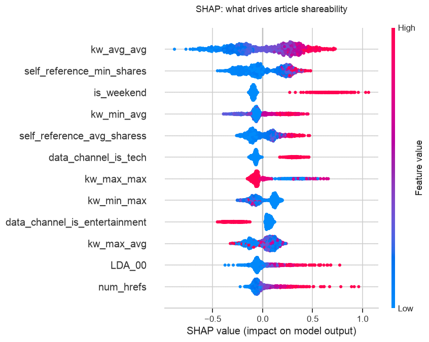
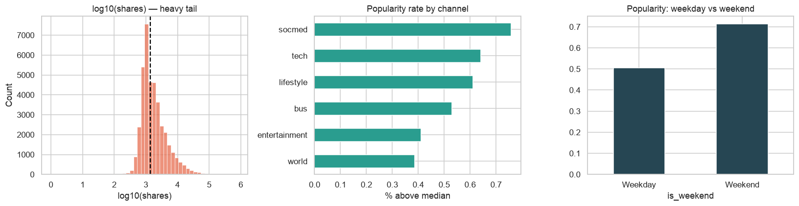

# Predictive Content Engagement — Online News Popularity


Predicting whether a piece of content will beat the **median share count**, and using SHAP to explain *which content characteristics drive sharing* — so editorial teams can optimise topics, headlines and timing on evidence, not instinct.

Built on the real **[UCI Online News Popularity](https://archive.ics.uci.edu/dataset/332/online+news+popularity)** dataset — **39,644 real Mashable articles** with 58 content features and their actual share counts.

> **Behavioural angle:** sharing is a behaviour. This models the content signals that trigger it — topic, keyword strength, and referencing already-popular content — which matter more than raw article length.

---

## Results (held-out test set)

| Model | Accuracy | F1 | ROC-AUC | PR-AUC |
|-------|---------:|---:|--------:|-------:|
| **XGBoost** | **0.67** | 0.70 | **0.734** | **0.757** |
| Random Forest | 0.66 | 0.70 | 0.720 | 0.741 |
| Logistic Regression | 0.66 | 0.68 | 0.708 | 0.725 |

**5-fold CV ROC-AUC (XGBoost): 0.740 ± 0.003** — very stable, and in line with the published benchmark for this dataset.

### What drives shareability (SHAP)


**Keyword strength** (how many shares an article's keywords historically attract), its **topic mix**, and whether it **references already-popular content** dominate — more than article length. These are concrete editorial levers.

### Where engagement concentrates


Social-media and tech channels, and weekend publishing, skew more popular.

---

## Methodology
1. **Target** — binary popularity: above/below the median 1,400 shares (the standard benchmark; shares are extremely heavy-tailed).
2. **Feature prep** — 58 content features; `url` and `timedelta` dropped as non-predictive ([`src/content_features.py`](src/content_features.py)).
3. **Model comparison** — Logistic Regression vs Random Forest vs XGBoost, judged on ROC-AUC / PR-AUC; 5-fold stratified CV.
4. **Explainability** — SHAP `TreeExplainer` surfaces the editorial drivers of sharing.

## Tech Stack
Python · pandas · NumPy · scikit-learn · XGBoost · SHAP · Matplotlib · Seaborn

---

## Repository Structure
```
├── README.md
├── requirements.txt
├── notebooks/
│   └── content_engagement_engine.ipynb
├── src/
│   └── content_features.py
├── data/            # download instructions — see data/README.md
├── images/
└── docs/
```

## How to Run
```bash
git clone https://github.com/kndukuba17-hub/Predictive-Content-Engagement-Engine.git
cd Predictive-Content-Engagement-Engine
pip install -r requirements.txt
# download the dataset into data/ (see data/README.md), then:
jupyter notebook notebooks/content_engagement_engine.ipynb
```

## Roadmap
- Predict the extreme-viral tail (top-decile shares, with imbalance handling).
- Add transformer embeddings of the headline/body (raw-text NLP).
- A "score-my-draft" Streamlit tool for editors.
